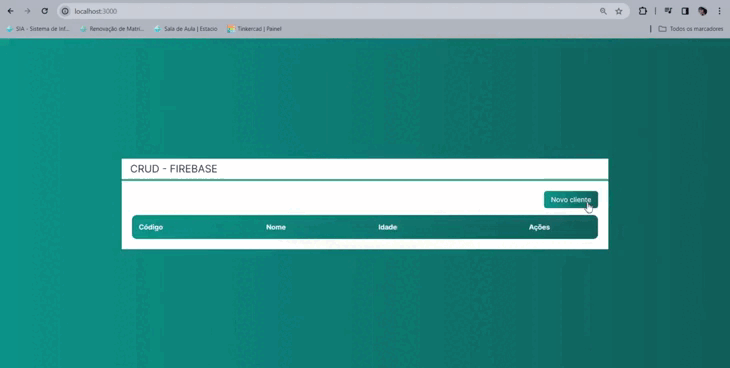

#### confirguração do next com firebase:

crie um arquivo `.env` e coloque os seguintes comando:

```
NEXT_PUBLIC_FIREBASE_API_KEY=sua chave secreta
NEXT_PUBLIC_FIREBASE_AUTH_DOMAIN=seu dominio
NEXT_PUBLIC_FIREBASE_PROJECT_ID=seu id
```

#### 🎲 como rodar:

```bash
# Acesse a pasta do projeto no terminal/cmd
$ cd Next-firebase-crud

# Instale as dependências
$ yarn || npm i

# Execute a aplicação em modo de desenvolvimento
$ yarn dev || npm run dev
```

### Tecnologias usadas nesse projeto:

- TypeScript
- React
- Next - versão apartir da 13
- Tailwind
- Firebase

## Projeto:

<h1 align="center">
  
</h1>
